<!-- animated contribution graph: real data and GitHub's own colors, cells pop in
     with a diagonal sweep (regenerated daily by .github/workflows/update-profile-art.yml) -->

<h3><code>mauro@github ~ $ ./contributions.sh</code></h3>

 
 

<!-- ascii portrait (left) + streak/numbers card (right). both svgs are
     840x880 so equal widths give equal heights.
     portrait: python scripts/portrait_prep.py && python scripts/portrait_svg.py (local, once)
     stats:    python scripts/stats_svg.py (same daily workflow) -->

<h3><code>mauro@github ~ $ whoami</code></h3>

<table>
<tr>
<td valign="top"></td>
<td valign="top"></td>
</tr>
</table>

 
 

<h3><code>mauro@github ~ $ cat about.txt</code></h3>

Software Engineering student (8th semester) from Jacareí, Brazil. 
Technology has been a natural interest since I was a kid — I like building 
applications that are modern, secure and actually useful to someone.

 

<h3><code>mauro@github ~ $ ls stack/</code></h3>

  
  
  
  
  
  
  
  
  
  
  
  

 

<h3><code>mauro@github ~ $ ls projects/</code></h3>

<table>
  <tr>
    <td width="33.33%" valign="top" align="center">
      <h3>Summo Order</h3>
      
Multi-tenant order and inventory platform, built and deployed for a client.

      
    </td>
    <td width="33.33%" valign="top" align="center">
      <h3>Ludex</h3>
      
Game review hub with price comparator across Steam, Epic, Nuuvem and GOG.

      
    </td>
    <td width="33.33%" valign="top" align="center">
      <h3>CodeQuest</h3>
      
Gamified platform for teaching programming. My final graduation project.

      
    </td>
  </tr>
  <tr>
    <td width="33.33%" valign="top" align="center">
      <h3>Spectrum</h3>
      
Lightweight YouTube multi-player for portrait monitors. Split screen, no clutter.

      
    </td>
    <td width="33.33%" valign="top" align="center">
      <h3>MX Studio</h3>
      
Scroll-linked video landing page with glassmorphism and AI-generated assets.

      
    </td>
    <td width="33.33%" valign="top" align="center">
      <h3>Pima SVM Analysis</h3>
      
Diabetes diagnosis from the Pima dataset, with a support vector machine.

      
    </td>
  </tr>
</table>

 

<h3><code>mauro@github ~ $ ./links.sh</code></h3>

<b>Full Stack Developer · Back-End · Machine Learning</b>

